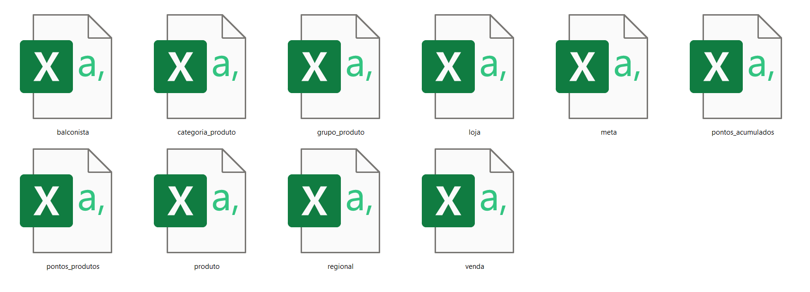
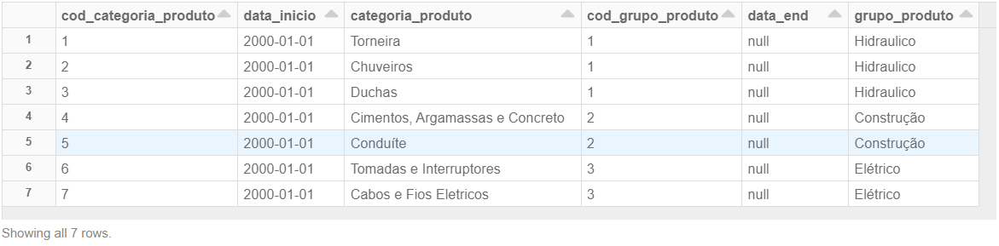
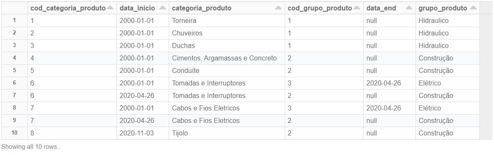

# Running Delta Lake on Google Cloud
##### Contact Information:
Bruno Nogueira Renzo<br>
brunorenzo6@outlook.com<br>
Bulky Consulting & Analytics<br>

### Intro:
Delta Lake is an open-source storage layer that brings ACID
transactions to Apache Spark™ and big data workloads.<br>
Delta Lake is now available in the latest version of Cloud Dataproc (version 1.5 Preview).
 
 ```shell
$ spark-shell --packages io.delta:delta-core_2.12:0.4.0
OR
$ spark-shell --jars /usr/lib/delta/jars/delta-core.jar
```
Obs: GCP-->Compute Engine-->VM Instances-->SSH to access the Dataproc Cluster

# MarketPlace Implementation
##### #GoogleCloud #Dataproc #Spark #DeltaLake #JupyterNotebook
MarketPlace use case




## Upload files to Google Cloud Storage
Use Cloud Storage bucket to store data.
https://cloud.google.com/storage/docs/uploading-objects#:~:text=Drag%20and%20drop%20the%20desired,that%20appears%2C%20and%20click%20Open.

## Apply Delta Table Format
* Create Dataproc cluster
* Submit a spark job to save these raw csv files now using Delta Table Format

 ```shell
$ spark-submit  --deploy-mode client --class example.hello --jars /usr/lib/delta/jars/delta-core.jar gs://bkt-scd-spark-1/csvToDelta.jar
```
csvToDelta.jar (package version of [csvToDelta.scala](csvToDelta/csvToDelta.scala) Spark code)

* Query current state using Dataproc **python Jupyter Notebook**
 ```python
from pyspark.sql import SparkSession

spark = SparkSession.builder \
.config("spark.jars.packages",'io.delta:delta-core_2.12:0.4.0') \
.getOrCreate()

from delta.tables import *

spark.sql("CREATE TABLE categoriaProduto USING DELTA LOCATION 'gs://bkt-scd-delta-1/categoriaProduto'")
spark.sql("CREATE TABLE grupoProduto USING DELTA LOCATION 'gs://bkt-scd-delta-1/grupoProduto'")

spark.sql("SELECT T1.*, T2.grupo_produto FROM CategoriaProduto t1 INNER JOIN GrupoProduto t2 ON t1.cod_grupo_produto = t2.cod_grupo_produto ORDER BY 1, 2").show()
```


## Merge Update
* Upload new data
* Submit a spark job to upload existing Delta Table

 ```shell
$ spark-submit  --deploy-mode client --class example.hello --jars /usr/lib/delta/jars/delta-core.jar gs://bkt-scd-spark-1/mergeDelta.jar
```
mergeDelta.jar (package version of [mergeDelta.scala](mergeDelta/mergeDelta.scala) Spark code)


* Query current state using Dataproc **python Jupyter Notebook**
 ```python
from pyspark.sql import SparkSession

spark = SparkSession.builder \
.config("spark.jars.packages",'io.delta:delta-core_2.12:0.4.0') \
.getOrCreate()

from delta.tables import *

spark.sql("CREATE TABLE categoriaProduto USING DELTA LOCATION 'gs://bkt-scd-delta-1/categoriaProduto'")
spark.sql("CREATE TABLE grupoProduto USING DELTA LOCATION 'gs://bkt-scd-delta-1/grupoProduto'")

spark.sql("SELECT T1.*, T2.grupo_produto FROM CategoriaProduto t1 INNER JOIN GrupoProduto t2 ON t1.cod_grupo_produto = t2.cod_grupo_produto ORDER BY 1, 2").show()
```



